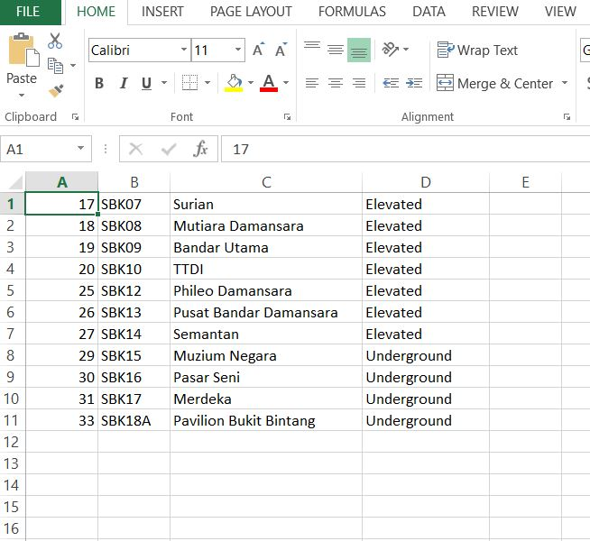

## Python Flask Application with CRUD, import and export CSV file

#### Feature

- _Add / Create new transit information._
- _Update / Edit transit information._
- _Delete transit information._
- _Upload / import csv file data to database._
- _Dowmload / export csv file._

#### Setup Database

1. Start wampserver/xampp
2. Create a database name _' flask_project '_ on [phpmyadmin](http://localhost/phpmyadmin/)
3. Open command prompt type _' python '_
4. Type _' from app import db'_
5. Type _' db.create_all() '_

 

| Rest Api                              |
| ------------------------------------- |
| GET http://localhost/                 |
| GET http://localhost/<int:id>         |
| POST http://localhost/create/<int:id> |
| POST http://localhost/update/<int:id> |
| POST http://localhost/delete/<int:id> |
| POST http://localhost/upload/         |
| GET http://localhost/csv_report/      |

 

#### Precautions For Using This Application

- _Don't send **NaN values** to the database._
- _Follow the **CSV structure** when manually creating or entering data into a .csv file._

   

  Example:

  
   

- _CSV file you are going to upload **no need** inculde table field name._
- _Upload feature for this application **only accept .CSV files**._
- _Upload feature **not support multiple files** upload._
- _Upload new csv file will update all existing data in the database._

> _**Violation any of the above will cause errors.**_

---

#### How to run this application?

> 1.  _Open command prompt._
> 2.  _Type '**pip install flask**'._
> 3.  _Type '**pip install flask-sqlalchemy**'._
> 4.  _Type '**flask run**' (Running on http://127.0.0.1:5000/)._

---

### Reference

1. [Flask CRUD Application with SQLAlchemy](https://codeloop.org/flask-crud-application-with-sqlalchemy/)

2. [Flask Tutorial: Upload CSV file and Insert rows into MySQL Database](https://medevel.com/flask-tutorial-upload-csv-file-and-insert-rows-into-the-database/)

3. [Generate CSV Report from MySQL Database using Python Flask](https://roytuts.com/generate-csv-report-from-mysql-database-using-python-flask/)
